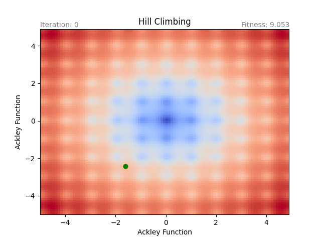

<p align="center">
  
</p>

# EAKit
EAKit is a Framework of Evolutionary Algorithms written in Swift. 
It is fully generic, simple to use and you can build your own evolutionary algorithm by using existing components. 

## Features
- [x] Genetic Algorithm
- [x] Evolutionary Strategy
- [x] Particle Swarm
- [x] Differential Evolution
- [x] Hill Climbing

## Requirements
- iOS 8+ / macOS 10.9+
- Xcode 10+
- Swift 5+

## Installation

### Carthage

### Swift Package Manager

### Swift Scripting

## Usage
Let's look at how simple it is!

### Hill Climbing

```swift
// Parameters of Hill Climbing
let parameters = try! EAHillClimbingParameters(
    populationCount: 10,
    generationsCount: 300,
    fitnessFunction: EASphereFunction(),
    deviation: 0.5
)
// Run the algorithm
let algorithm = EAHillClimbing(parameters: parameters)
let result = algorithm.run()
// Show result
print(result.bestPopulation.bestIndividual?.fitness)
print(result.bestPopulation.bestIndividual?.data)
```

<p align="center">
  
</p>

### Genetic Algorithm

```swift
// Data of TSP Fitness Function
let cities = [
    EATSPCity("A", [60.0, 200.0]),
    EATSPCity("B", [80.0, 200.0]),
    EATSPCity("C", [80.0, 180.0]),
    EATSPCity("D", [140.0, 180.0]),
    EATSPCity("E", [20.0, 160.0]),
    EATSPCity("F", [100.0, 160.0]),
    EATSPCity("G", [200.0, 160.0]),
    EATSPCity("H", [140.0, 140.0]),
    EATSPCity("I", [40.0, 120.0]),
    EATSPCity("J", [100.0, 120.0]),
    EATSPCity("K", [180.0, 100.0]),
    EATSPCity("L", [60.0, 80.0]),
    EATSPCity("M", [120.0, 80.0]),
    EATSPCity("N", [180.0, 60.0]),
    EATSPCity("O", [20.0, 40.0]),
    EATSPCity("P", [100.0, 40.0]),
    EATSPCity("Q", [200.0, 40.0]),
    EATSPCity("R", [20.0, 20.0]),
    EATSPCity("S", [60.0, 20.0]),
    EATSPCity("T", [160.0, 20.0])
]
let fitnessFunction = EATSPFunction(cities: cities)
// Parameters of Genetic Algorithm
let parameters = try! EAGeneticAlgorithmParameters(
    populationCount: 20,
    generationsCount: 2000,
    fitnessFunction: fitnessFunction,
    isElitism: true,
    selection: EARandomSelection(isElitism: true),
    crossover: EATSPTwoPointCrossover(threshold: 1.0),
    mutation: EASwapMutation(threshold: 0.9, count: 1)
)
// Run the algorithm
let algorithm = EAGeneticAlgorithm(parameters: parameters)
let result = algorithm.run()
// Show result
print(result.bestPopulation.bestIndividual?.fitness)
print(result.bestPopulation.bestIndividual?.data)
```

### Evolutionary Strategy
```swift
// Configuration of Evolutionary Strategy 
let configuration = try! EAEvolutionaryStrategyConfiguration(µ: 20, ρ: 2, selectionStrategy: .plus, λ: 20)
// Parameters of Evolutionary Strategy
let parameters = try! EAEvolutionaryStrategyParameters(
    generationsCount: 2000,
    configuration: configuration,
    fitnessFunction: EASphereFunction(),
    selection: EARandomSelection(),
    recombination: EAESIntermadiateRecombination(),
    mutation: EAESNormalMutation(threshold: 1.0, σ: 0.5)
)
// Run the algorithm
let algorithm = EAEvolutionaryStrategy(parameters: parameters)
let result = algorithm.run()
// Show result
print(result.bestPopulation.bestIndividual?.fitness)
print(result.bestPopulation.bestIndividual?.data)
```

### Particle Swarm

```swift
// Parameters of Particle Swarm
let parameters = try! EAParticleSwarmParameters(
    particlesCount: 30,
    iterationsCount: 1000,
    velocity: EAParticleSwarmVelocity(maximum: EASphereFunction().distance / 30.0),
    learning: .defaultLearning,
    inertiaWeight: .defaultInertiaWeight,
    fitnessFunction: EASphereFunction()
)
// Run the algorithm
let algorithm = EAParticleSwarm(parameters: parameters)
let result = algorithm.run()
// Show result
print(result.bestPopulation.bestIndividual?.fitness)
print(result.bestPopulation.bestIndividual?.data)
```

### Differential Evolution

```swift
// Parameters of Differential Evolution
let parameters = try! EADifferentialEvolutionParameters(
    populationCount: 10,
    generationsCount: 20,
    selection: EARandomSelection(),
    mutationStrategy: EADERand1BinMutationStrategy(f: 0.5, λ: 0.5),
    crossover: EADifferentialEvolutionCrossover(cr: 0.9),
    fitnessFunction: EASphereFunction()
)
// Run the algorithm
let algorithm = EADifferentialEvolution(parameters: parameters)
let result = algorithm.run()
// Show result
print(result.bestPopulation.bestIndividual?.fitness)
print(result.bestPopulation.bestIndividual?.data)
```

## Components
Each evolutionary algorithm is decomposed to components. The components are interchangeable between algorithms. Each component is defined by protocol.

### EAFitnessFunctionProtocol
Fitness Function protocol is the most important component. It defines a description of your problem. 

There are already built-in some fitness functions:
- Artificial Landscapes
  - EASphereFunction
  - EARosenbrockFunction
  - EARastriginFunction
  - EAAckleyFunction
  - EASchwefelFunction
  - EAEasomFunction
- TSP
  - EATSPFunction
- Others
  - EATextFunction

### EASelectionProtocol
Selection component is used for selecting parents.

There are already built-in some selections:
- General
  - EARandomSelection
  - EARouletteSelection
  - EATournamentSelection

### EACrossoverProtocol
Crossover component is used for crossing individuals, e.g. two parents selected from a selection component to create offsprings. 

There are already built-in some crossovers:
- General
  - EASinglePointCrossover
  - EATwoPointCrossover
  - EAKPointCrossover
  - EAUniformCrossover
- TSP (Special crossovers for TSP)
  - EATSPSinglePointCrossover
  - EATSPTwoPointCrossover
- Differential Evolution (Special crossovers for DE)
  - EADifferentialEvolutionCrossover
  
### EAMutationProtocol
Mutation component is used for mutating individuals, e.g. mutate offsprings from a crossover component. 

There are already built-in some mutations:
- General
  - EASwapMutation
  - EAFloatingNumericMutation
  - EAReplacementMutation
  - EANormalDistributionMutation
- Evolutionary Strategy (Special mutations for ES)
  - EAESNormalMutation

## Custom Implementation
