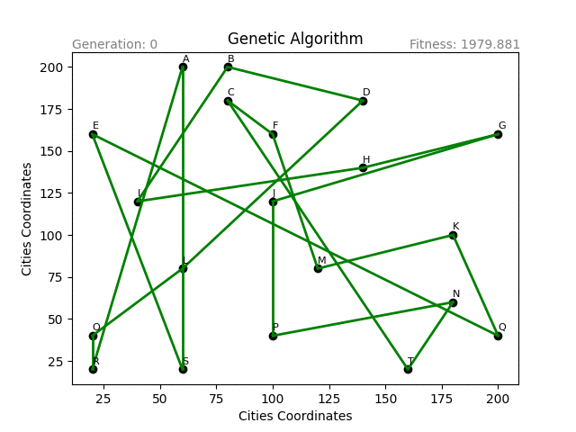
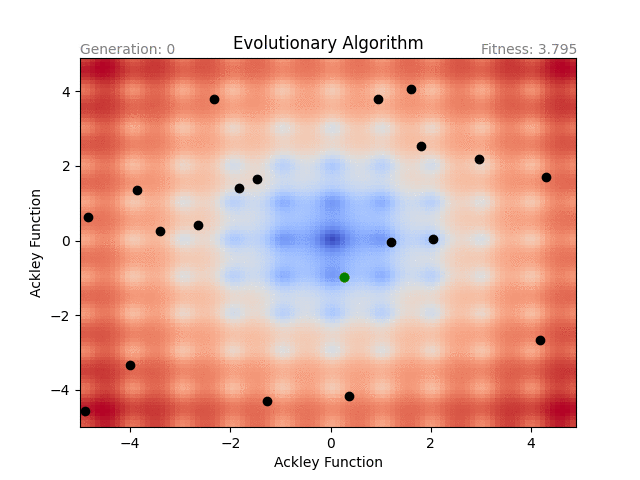
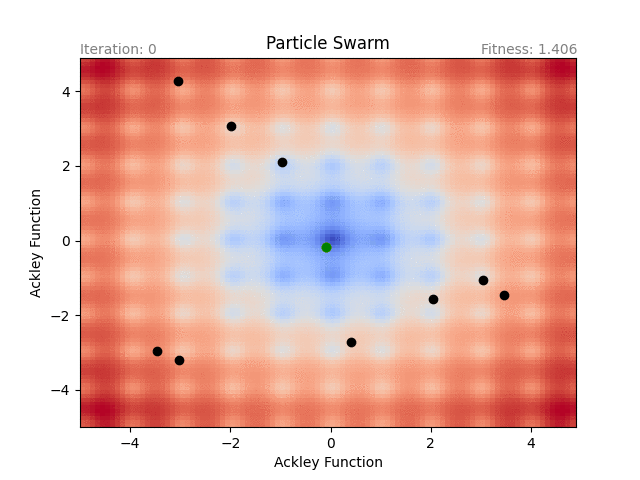
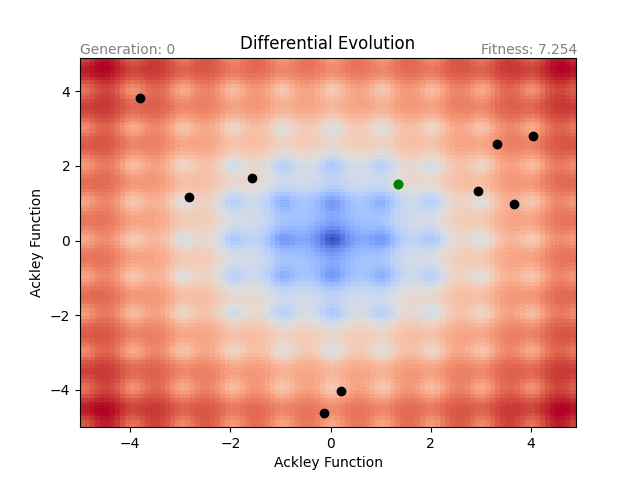

<p align="center">
  
</p>

[](https://github.com/Carthage/Carthage)
[](https://cocoapods.org/pods/EAKitAI)
[](https://swift.org/package-manager)
[](https://swift.org/)
[](https://github.com/Li-Bot/eakit)
[](http://makeapullrequest.com)

# EAKit
EAKit is a Framework of Evolutionary Algorithms written in Swift. 
It is fully generic, architecture (algorithms) based on (interchangeable) components, simple to use and you can build your own evolutionary algorithm by using existing components.

## Contents
- [Features](#features)
- [Requirements](#requirements)
- [Installation](#installation)
- [Usage](#usage)
- [Components](#components)
- [Custom Implementation](#custom-implementation)
- [Future](#future)
- [License](#license)

## Features
- [x] Genetic Algorithm
- [x] Evolutionary Strategy
- [x] Particle Swarm
- [x] Differential Evolution
- [x] Hill Climbing

## Requirements
- iOS 8+ / macOS 10.9+
- Xcode 10+
- Swift 5+

## Installation

### Carthage
```ogdl
github "Li-Bot/eakit.git" ~> 0.1.0
```

### Swift Package Manager
```swift
dependencies: [
    .package(url: "https://github.com/Li-Bot/eakit.git", .upToNextMajor(from: "1.0.0"))
]
```

### Cocoapods
```ruby
pod 'EAKitAI', '~> 0.1.0'
```

## Usage
Let's look at how simple it is!

### Hill Climbing

```swift
// Parameters of Hill Climbing
let parameters = try! EAHillClimbingParameters(
    populationCount: 20,
    generationsCount: 101,
    fitnessFunction: EAAckleyFunction(),
    deviation: 0.5
)
// Run the algorithm
let algorithm = EAHillClimbing(parameters: parameters)
let result = algorithm.run()
// Show result
print(result.bestPopulation.bestIndividual?.fitness)
print(result.bestPopulation.bestIndividual?.data)
```

<p align="center">
  
</p>

### Genetic Algorithm

```swift
// Data of TSP Fitness Function
let cities = [
    EATSPCity("A", [60.0, 200.0]), EATSPCity("B", [80.0, 200.0]), EATSPCity("C", [80.0, 180.0]),
    EATSPCity("D", [140.0, 180.0]), EATSPCity("E", [20.0, 160.0]), EATSPCity("F", [100.0, 160.0]),
    EATSPCity("G", [200.0, 160.0]), EATSPCity("H", [140.0, 140.0]), EATSPCity("I", [40.0, 120.0]),
    EATSPCity("J", [100.0, 120.0]), EATSPCity("K", [180.0, 100.0]), EATSPCity("L", [60.0, 80.0]),
    EATSPCity("M", [120.0, 80.0]), EATSPCity("N", [180.0, 60.0]), EATSPCity("O", [20.0, 40.0]),
    EATSPCity("P", [100.0, 40.0]), EATSPCity("Q", [200.0, 40.0]), EATSPCity("R", [20.0, 20.0]),
    EATSPCity("S", [60.0, 20.0]), EATSPCity("T", [160.0, 20.0])
]
let fitnessFunction = EATSPFunction(cities: cities)
// Parameters of Genetic Algorithm
let parameters = try! EAGeneticAlgorithmParameters(
    populationCount: 20,
    generationsCount: 301,
    fitnessFunction: fitnessFunction,
    isElitism: true,
    selection: EARandomSelection(isElitism: true),
    crossover: EATSPTwoPointCrossover(threshold: 1.0),
    mutation: EASwapMutation(threshold: 0.9, count: 1)
)
// Run the algorithm
let algorithm = EAGeneticAlgorithm(parameters: parameters)
let result = algorithm.run()
// Show result
print(result.bestPopulation.bestIndividual?.fitness)
print(result.bestPopulation.bestIndividual?.data)
```

<p align="center">
  
</p>

### Evolutionary Strategy
```swift
// Configuration of Evolutionary Strategy 
let configuration = try! EAEvolutionaryStrategyConfiguration(µ: 20, ρ: 3, selectionStrategy: .plus, λ: 20)
// Parameters of Evolutionary Strategy
let parameters = try! EAEvolutionaryStrategyParameters(
    generationsCount: 101,
    configuration: configuration,
    fitnessFunction: EAAckleyFunction(),
    selection: EARandomSelection(),
    recombination: EAESIntermadiateRecombination(),
    mutation: EAESNormalMutation(threshold: 1.0, σ: 0.5)
)
// Run the algorithm
let algorithm = EAEvolutionaryStrategy(parameters: parameters)
let result = algorithm.run()
// Show result
print(result.bestPopulation.bestIndividual?.fitness)
print(result.bestPopulation.bestIndividual?.data)
```

<p align="center">
  
</p>

### Particle Swarm

```swift
// Parameters of Particle Swarm
let parameters = try! EAParticleSwarmParameters(
    particlesCount: 10,
    iterationsCount: 101,
    velocity: EAParticleSwarmVelocity(maximum: EASphereFunction().distance / 30.0),
    learning: .defaultLearning,
    inertiaWeight: .defaultInertiaWeight,
    fitnessFunction: EAAckleyFunction()
)
// Run the algorithm
let algorithm = EAParticleSwarm(parameters: parameters)
let result = algorithm.run()
// Show result
print(result.bestPopulation.bestIndividual?.fitness)
print(result.bestPopulation.bestIndividual?.data)
```

<p align="center">
  
</p>

### Differential Evolution

```swift
// Parameters of Differential Evolution
let parameters = try! EADifferentialEvolutionParameters(
    populationCount: 10,
    generationsCount: 101,
    selection: EARandomSelection(),
    mutationStrategy: EADERand1BinMutationStrategy(f: 0.5, λ: 0.5),
    crossover: EADifferentialEvolutionCrossover(cr: 0.9),
    fitnessFunction: EAAckleyFunction()
)
// Run the algorithm
let algorithm = EADifferentialEvolution(parameters: parameters)
let result = algorithm.run()
// Show result
print(result.bestPopulation.bestIndividual?.fitness)
print(result.bestPopulation.bestIndividual?.data)
```

<p align="center">
  
</p>

## Components
Each evolutionary algorithm is decomposed to components. The components are interchangeable between algorithms. Each component is defined by protocol.

Find out more about [components here](Docs/components.md).

## Custom Implementation
Let's look at how simple it is to implement your own components & evolutionary algorithms. 

Find out more about [custom implementation here](Docs/implementation.md).

## Future
- More evolutionary algorithms
- More components 
- More built-in functions

## License
EAKit is released under the GNU GPLv3 license. See the [LICENSE here](LICENSE.md).
